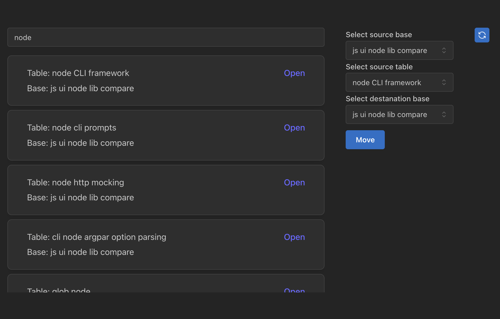

# airtable wrapper

Effortlessly move tables across bases



# Features

- [x] Move tables across bases
- [x] Search tables across bases

## TODO

- [x] serve web app with python
- [x] dockerize
- [x] fix copy fields with dates
- [x] refresh the database after a move in app
- [x] implement refetch all bases and tables
- [ ] copy table descripton
- [ ] test refetch


## Tech debt

- [x] try to use podman instead of docker (cannot find external Dockerfile)
- [ ] format python code on save
- [ ] fix typings errors

## Development

```shell
uv sync
```

```shell
uv run fastapi dev main.py
```

```shell
uv run fastapi run main.py
```
